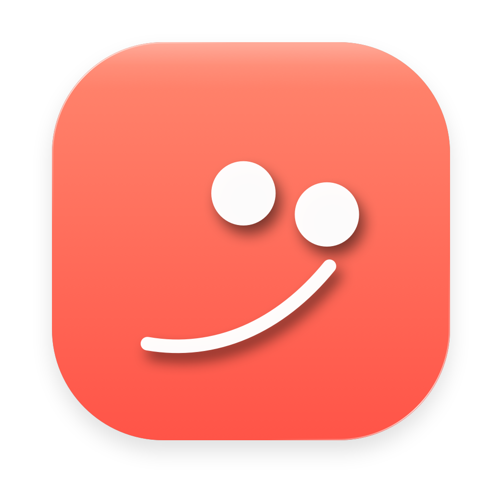
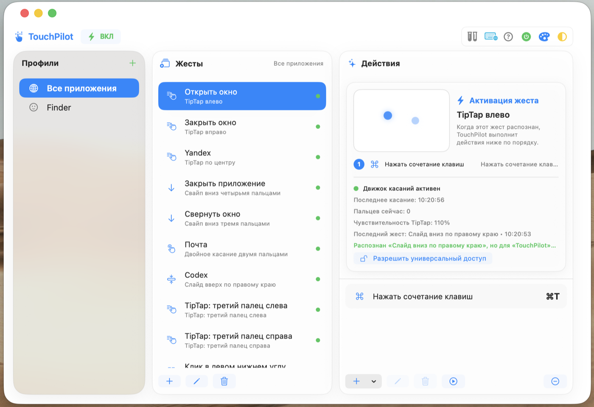
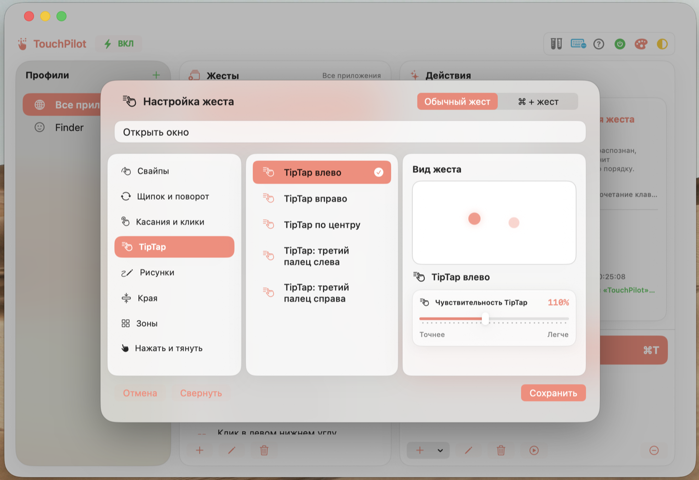
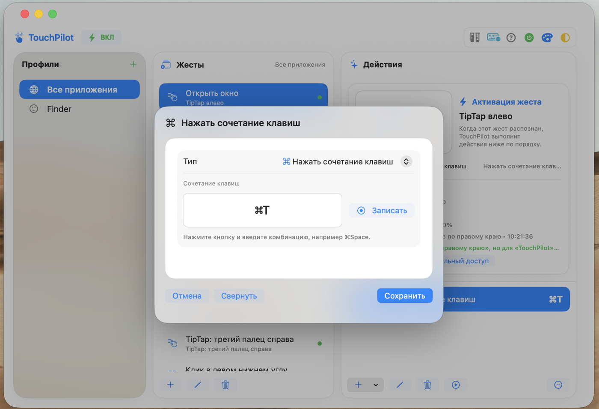
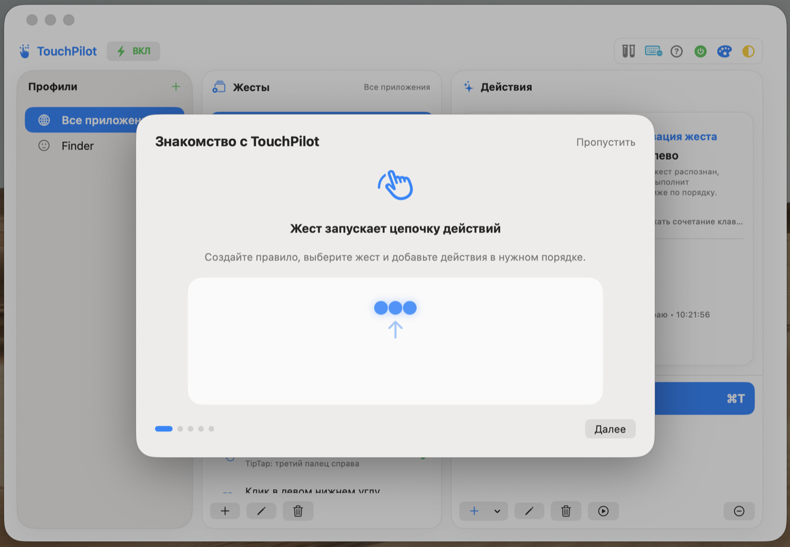
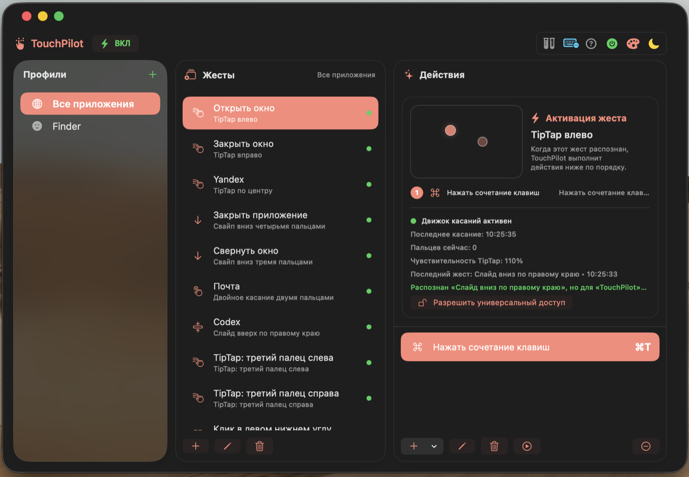
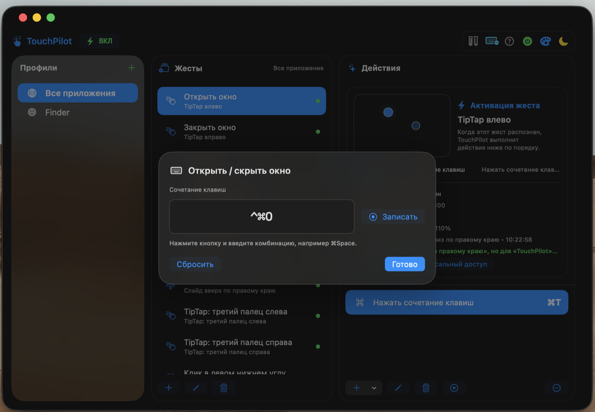

<p align="center">
  
</p>

<h1 align="center">TouchPilot</h1>

<hr>

<p align="center">
  Нативное приложение для macOS, которое превращает жесты трекпада в команды,<br>
  сочетания клавиш и цепочки действий.
</p>

<p align="center">
  <a href="https://github.com/Kapfilm/TouchPilot/releases/latest"></a>
  
  
  
  <a href="https://github.com/Kapfilm/TouchPilot/actions/workflows/release.yml"></a>
</p>

<p align="center">
  <a href="https://github.com/Kapfilm/TouchPilot/releases/latest">Скачать последнюю версию</a>
  ·
  <a href="https://github.com/Kapfilm/TouchPilot/issues/new">Сообщить о проблеме</a>
</p>



## Возможности

- свайпы двумя, тремя и четырьмя пальцами;
- щипок и поворот;
- одиночные и двойные касания, клики двумя и тремя пальцами;
- TipTap, включая жесты третьим пальцем;
- круги, треугольники и другие рисованные жесты;
- жесты вдоль левого и правого края трекпада;
- клики в углах и центральных зонах;
- «нажать и тянуть» двумя или тремя пальцами;
- отдельные профили для Finder и любых установленных приложений;
- обычные жесты и жесты с зажатой клавишей Command;
- несколько последовательных действий для одного жеста;
- тестовый режим без реального выполнения команд;
- импорт и экспорт настроек в JSON;
- светлая и тёмная темы, коралловый и синий акценты;
- запуск вместе с macOS;
- режим очистки, блокирующий клавиатуру и трекпад;
- автоматическая проверка обновлений через GitHub Releases.

## Действия

TouchPilot умеет:

- отправлять сочетания клавиш;
- запускать и закрывать приложения;
- открывать сайты и локальные пути;
- показывать уведомления;
- блокировать экран, запускать заставку, выключать дисплей или переводить Mac в сон;
- завершать сеанс, перезагружать или выключать Mac с подтверждением;
- управлять громкостью, воспроизведением, яркостью и подсветкой клавиатуры;
- открывать Mission Control, окна приложения, рабочий стол, Launchpad, Spotlight и Центр уведомлений;
- переключать тёмную тему;
- создавать снимки всего экрана или выбранной области.

## Интерфейс

| Настройка жеста | Редактор действия |
| --- | --- |
|  |  |

| Обучение | Тёмная тема |
| --- | --- |
|  |  |



## Очистка клавиатуры и трекпада

Режим очистки временно блокирует ввод с клавиатуры, трекпада и мыши, чтобы технику можно было безопасно протереть без случайных кликов, набора текста и запуска жестов. На всех подключённых экранах появляется полноэкранная инструкция с индикатором разблокировки.

Для запуска:

1. Разрешите TouchPilot «Универсальный доступ».
2. Нажмите значок клавиатуры в верхней панели TouchPilot.
3. Убедитесь, что обе клавиши Command отпущены.
4. Нажмите кнопку запуска режима очистки.

Для выхода дважды нажмите одновременно **левую и правую клавиши Command**, полностью отпуская их после каждого нажатия. Второе нажатие нужно выполнить в течение четырёх секунд, затем ещё раз отпустить обе клавиши.

Режим очистки не удаляет настройки, не выполняет назначенные действия и автоматически восстанавливает обычный ввод после разблокировки.

## Установка

1. Скачайте `TouchPilot-0.6.10.dmg` со страницы [Releases](https://github.com/Kapfilm/TouchPilot/releases).
2. Откройте DMG и перетащите TouchPilot в папку Applications.
3. Запустите TouchPilot.
4. Разрешите приложению «Универсальный доступ» в `Системные настройки → Конфиденциальность и безопасность`.
5. Если macOS блокирует первый запуск неподписанной версии, нажмите приложение правой кнопкой мыши и выберите «Открыть».

TouchPilot работает в строке меню. Закрытие основного окна не завершает приложение.

## Обновления

Приложение проверяет последний публичный релиз GitHub не чаще одного раза в сутки. При появлении новой версии TouchPilot предлагает скачать DMG в папку «Загрузки» и автоматически открывает его.

Проверку можно запустить вручную из меню TouchPilot командой «Проверить обновления…».

TouchPilot не устанавливает обновление без подтверждения пользователя и не заменяет запущенное приложение самостоятельно.

## Настройки и совместимость

Основной пресет хранится в:

```text
~/Library/Application Support/TouchPilot/preset.json
```

Экспорт создаётся в:

```text
~/Documents/TouchPilot/TouchPilotGestures.json
```

Поддерживается импорт настроек из TouchPilot и TouchPilot Improved. Если основной пресет повреждён, TouchPilot не перезаписывает его и отключает автосохранение до успешного импорта.

## Системные требования

- macOS 14 Sonoma или новее;
- встроенный трекпад MacBook или Apple Magic Trackpad;
- разрешение «Универсальный доступ» для отправки клавиш и блокировки ввода;
- разрешение на уведомления для соответствующего действия.

Raw-touch распознавание использует закрытый системный `MultitouchSupport.framework`. После крупных обновлений macOS отдельные низкоуровневые жесты могут потребовать адаптации.

## Конфиденциальность

- правила и настройки хранятся локально;
- аккаунт и регистрация не нужны;
- TouchPilot не отправляет телеметрию;
- сеть используется только для запроса последнего релиза и скачивания выбранного обновления с GitHub;
- содержимое нажатий не записывается и не передаётся.

## Сборка

Потребуются Xcode Command Line Tools и Swift 5.9 или новее.

```bash
swift test
./scripts/build_app.sh
```

Приложение появится в `build/TouchPilot.app`.

Для создания DMG:

```bash
./scripts/build_dmg.sh
```

Готовый образ появится в `build/TouchPilot-<version>.dmg`.

## Выпуск новой версии

1. Обновите `CFBundleShortVersionString` и `CFBundleVersion` в `Resources/Info.plist`.
2. Добавьте описание изменений в `CHANGELOG.md`.
3. Создайте и отправьте тег:

```bash
git tag v0.6.10
git push origin v0.6.10
```

GitHub Actions запустит тесты, соберёт DMG и прикрепит его к новому GitHub Release.

## Contributors

- [Владимир (@Kapfilm)](https://github.com/Kapfilm) — автор и создатель TouchPilot.
- **Codex (OpenAI)** — разработка, аудит, тестирование, документация и подготовка релизов.

[Все участники проекта](https://github.com/Kapfilm/TouchPilot/graphs/contributors)

## English

TouchPilot is a native macOS menu-bar utility that maps trackpad gestures to keyboard shortcuts, apps, URLs, notifications, system commands, and ordered action chains. It supports per-app profiles, local JSON presets, themes, a safe test mode, and update downloads from GitHub Releases.
